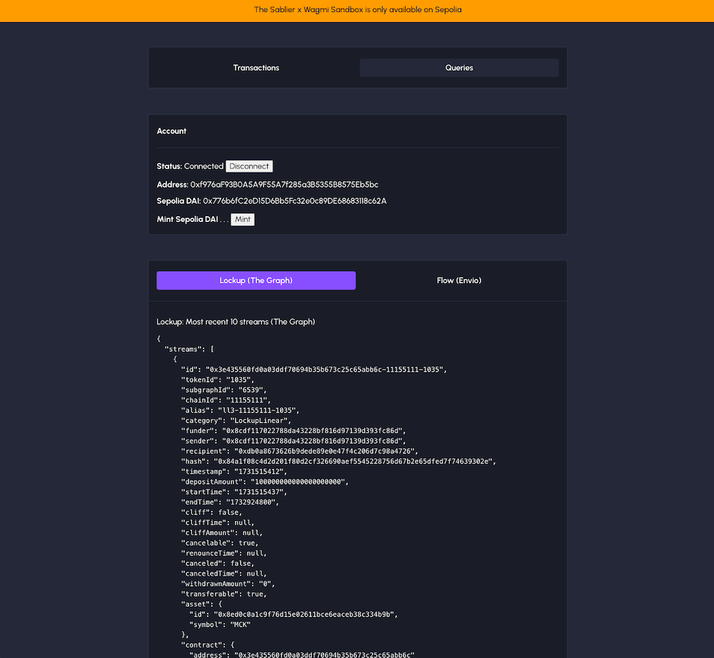

# Sablier Sandbox

Front-end sandbox development environments for Sablier. Create streams onchain or source them for preview from indexers
(the graph, envio).

The sandbox features integration examples for both EVM (Sepolia) and Solana (Devnet).

| Product          | EVM Sandbox | Solana Sandbox |
| ---------------- | ----------- | -------------- |
| Lockup Linear    | ✔︎         | ✔︎            |
| Lockup Dynamic   | ✔︎         | -              |
| Lockup Tranched  | ✔︎         | -              |
| Flow             | ✔︎         | -              |
| Instant Airdrops | 🕑          | 🕑             |
| Vested Airdrops  | 🕑          | -              |

## Featured Products 🔮

### 1. Lockup 🔮

There are three types of lockup streaming in Sablier:

- `Lockup Linear`, which creates streams with linear streaming functions
- `Lockup Dynamic`, which creates streams with dynamic streaming functions (examples: exponentials, logarithms)
- `LockupTranched`, which creates streams with stepper/tranched streaming functions (examples: monthly, timelocks, step
  functions)

> [!IMPORTANT]
>
> In some versions of Sablier, each flavor (LL, LD, LT) of Lockup was housed in its own contract. With the latest
> implementations, the Sablier Lockup contracts will all be accessible through a unified merged interface (Lockup Merged
> or LK).

We also support examples on how to **Withdraw** from a Lockup stream.

For more technical details, please refer to our [documentation](https://docs.sablier.com).

### 2. Flow 🔮

Flow streams work within an open-ended model (no upfront deposits, top-ups, rate adjustments, no end date). The sandbox
will showcase how to create a **Flow** stream with a certain rate per second and initial deposit (which can also be
topped up later on).

We also support examples of how to **Withdraw** from a Flow stream.

For more technical details, please refer to our [documentation](https://docs.sablier.com).

### 3. Airdrops 🔮

Instant and vested airdrops facilitate distribution of tokens (through one-time claims or streams) at scale. This
sandbox doesn't currently feature integration examples. Feel free to reach out to the team for guidance.

For more technical details, please refer to our [documentation](https://docs.sablier.com).

## Environments and Examples

### EVM: Wagmi 🟦

The official Sablier interface uses [wagmi](wagmi.sh/) and [viem](https://viem.sh/). Both libraries offer top-notch
support (check the docs and their github) and integrate nicely with wallet managers like RainbowKit or AppKit.

| Flow (Form)                            | Lockup (Form)                                    |
| -------------------------------------- | ------------------------------------------------ |
|  |  |

| Headless (Form)                           | Queries                                  |
| ----------------------------------------- | ---------------------------------------- |
|  |  |

#### Features

**↪ Single stream management through Lockup**

- Preview the 10 most recent Lockup (LL, LD or LT) streams using The Graph
- Create an LL, LD or LT stream with Durations using the UI Form
- Create an LL, LD or LT stream with Durations in headless mode (tweak durations in code)
- Create an LL, LD or LT stream with Timestamps in headless mode (tweak timestamps in code)
- Withdraw from any Lockup (LL, LD or LT) stream using the UI Form

**↪ Single stream management through Flow**

- Preview the 10 most recent Flow streams using Envio
- Create a Flow stream using the UI Form
- Withdraw from a Flow stream using the UI Form

**↪ Batch stream creation through Batch Lockup**

- Create group of LL, LD or LT streams with all possible configurations in headless mode, through a dedicated periphery.

Most of the transaction magic happens in [`models/LockupCore.ts`](/examples/evm/src/models/LockupCore.ts) and
[`models/FlowCore.ts`](/examples/evm/src/models/FlowCore.ts). Have a look to understand how parameters are formatted
(strings to BigInt, padding numbers with decimals, etc.) and sent to the contracts.

For the **headless** mode, see [`constants/data.ts`](/examples/evm/src/constants/data.ts). Here, you'll be able to tweak
the parameters to create streams of different values or shapes (segments).

**↪ Misc.**

- Mint [Sepolia DAI](https://sepolia.etherscan.io/token/0x776b6fc2ed15d6bb5fc32e0c89de68683118c62a) tokens
- Approve spending DAI tokens for any Lockup or Flow contract

#### Next steps

In the UI Forms, you may find `Prefill form` buttons. Clicking on them will add pre-configured data into the fields as
an example of what the data should look like.

After you create a test stream, make sure to connect to our main [app.sablier.com](https://app.sablier.com) interface
with your "sender" wallet to see what the stream [actually looks like](https://docs.sablier.com/apps/features/overview).

| Payload (LD with two segments)            | Shape                                      |
| ----------------------------------------- | ------------------------------------------ |
|  |  |

---

### @solana/kit 🟪

The [examples/solana](/examples/solana/) directory features an integration of Sablier's Solana contracts into a Next app
powered by [@solana/kit](https://github.com/anza-xyz/kit).

> [!TIP]
>
> The Solana examples do not include all possible variations since some features haven't been ported over yet.

#### Features

- Create an LL stream with Durations
- Withdraw from an LL stream

#### Considerations

The @solana/kit transaction signing is a bit clunky, so we're going to use the RPC methods to get our transaction
through.

---

## Airdrops Helper

### Merkle Proof Generator

For customers integrating airdrop campaigns into their own UI we recommend either:

- using a self-hosted [rust merkle-api](https://github.com/sablier-labs/merkle-api)
- getting in touch for a scalable dedicated server (managed by Sablier)
- pre-generating proofs and serving them locally in their own app

For the final option, a TS script which computes the list of merkle proofs can be
[found here](https://gist.github.com/gavriliumircea/c94ccbabac4b71c307040a3516207ae1).
